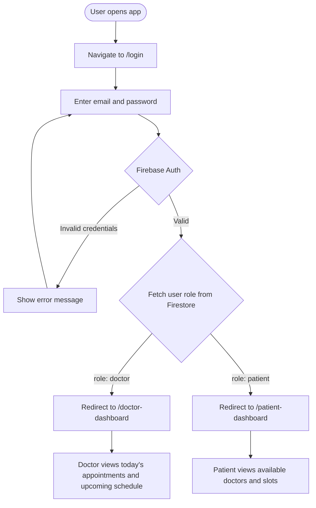
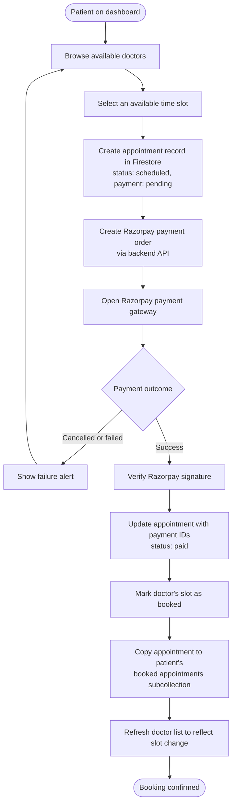
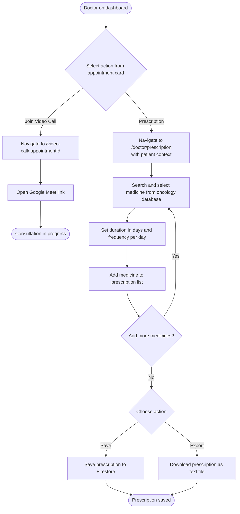
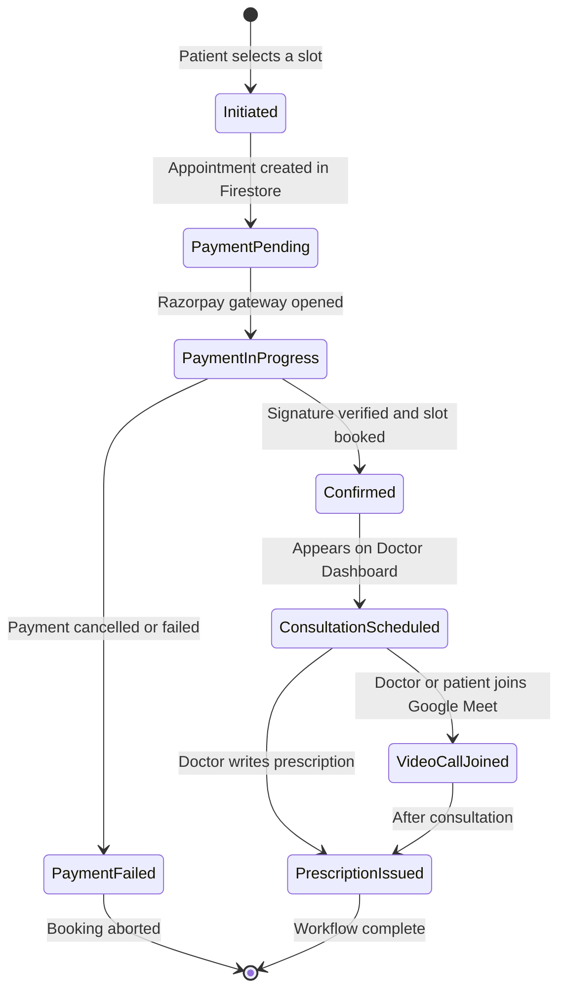
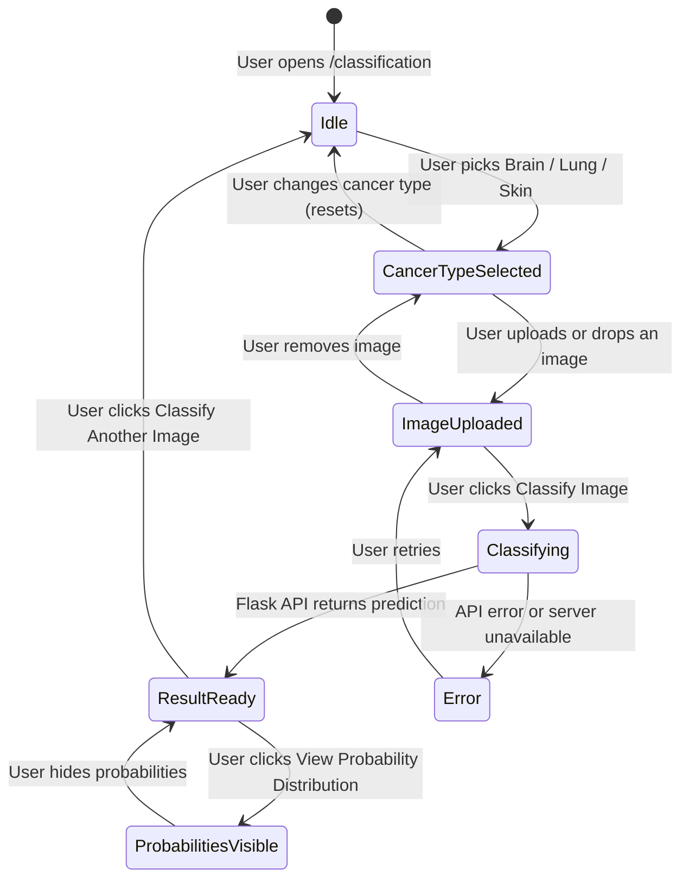
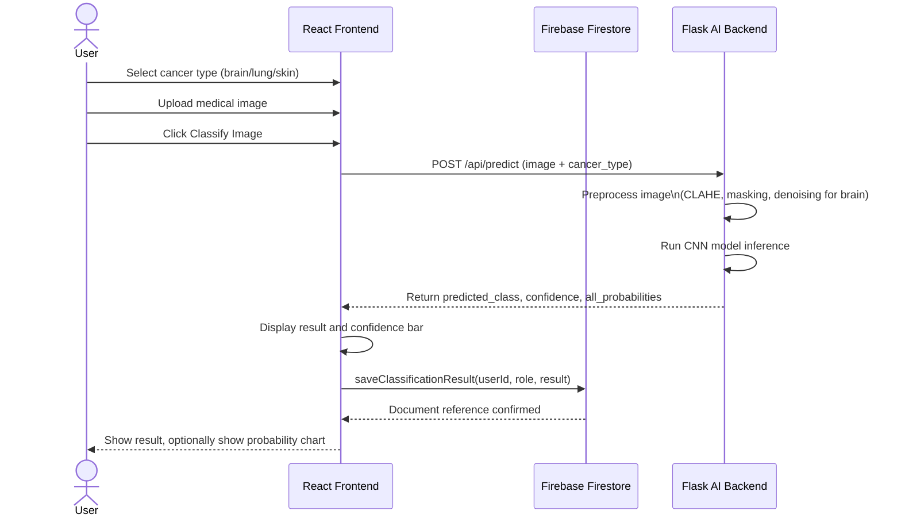

# Mediflow-3
Unable to deploy this project because the models were to large as they are built from scratch

A full-stack oncology platform that combines appointment management, AI-powered cancer image classification, and digital prescription management into a single system for doctors and patients.

---

## Overview

Mediflow-3 is built for oncology workflows. Doctors can view their scheduled appointments, start video consultations, issue digital prescriptions, and run AI cancer classification on medical images. Patients can browse available doctors, book time slots, pay online, and access their prescriptions. Both roles share a classification history so past AI results are always on hand.

---
<p align="center">
  
  
</p>

<p align="center">
  
  
</p>

<p align="center">
  
  
</p>

## Tech Stack

**Frontend**
- React 18 with TypeScript
- Vite
- React Router v6

**Backend / AI**
- Python (Flask) REST API
- PyTorch (custom CNN models)
- OpenCV, scikit-image (image preprocessing)
- GPU-accelerated inference (CUDA, falls back to CPU)

**Database / Auth**
- Firebase Authentication (email/password, role-based)
- Firebase Firestore (users, appointments, prescriptions, classification results)

**Payments**
- Razorpay (payment orders and signature verification)

**Video Calls**
- Google Meet (meeting links generated per appointment)

---

## Features
### AI Cancer Image Classification

**Classify an image** (`/classification`)

- Supports three cancer types:
  - **Brain Tumor** — classifies MRI scans into Glioma, Meningioma, No Tumor, or Pituitary
  - **Lung Cancer** — classifies histopathology images into Adenocarcinoma, Benign Tissue, or Squamous Cell Carcinoma
  - **Skin Cancer** — classifies lesion images into Actinic Keratoses, Basal Cell Carcinoma, Benign Keratosis, Dermatofibroma, Melanocytic Nevi, Melanoma, or Vascular Lesions
- Upload via file picker or drag-and-drop (PNG, JPG, JPEG, BMP, TIFF, max 16 MB)
- Returns predicted class and optionally shows full probability distribution for all classes with a confidence bar chart
- Results are saved to Firestore after every successful classification
### Gemini API integration for clinical support decisions
- Possible diagnosis
- Recommended tests
- Risk assessment
  
### Authentication and Role Management

- Email/password login via Firebase Authentication
- Two roles: **Doctor** and **Patient**
- Role-based routing: doctors go to `/doctor-dashboard`, patients go to `/patient-dashboard`
- Protected routes — unauthenticated users are redirected to `/login`

---

### Doctor Dashboard

- Displays today's scheduled appointments as clickable cards, sorted by time slot
- Displays the next 5 upcoming appointments sorted by date and time
- Each appointment card shows patient name, patient ID, email, time slot, payment status, and consultation fee
- Two quick actions per card: **Join Video Call** and **Write Prescription**
- Quick action cards to navigate to My Patients, Cancer Classification, Classification History, and Prescription History
- Doctor profile panel showing specialization, department, phone, and status

---

### Patient Dashboard

- Browse all available doctors with their specialization, department, and photo
- View each doctor's time slots (available vs booked)
- Book an appointment slot (₹500 consultation fee)
- Razorpay payment flow: order creation, payment gateway, signature verification, slot update
- After successful payment the appointment is recorded and the slot is marked booked
- Navigate to My Appointments and My Prescriptions from the header

---

### Appointment Management (Patient)

- `/booked-appointments` — lists all appointments the patient has booked with their status and details

---

### Video Calls

- `/video-call/:appointmentId` — opens a Google Meet video call associated with the appointment
- Accessible from the appointment card on the Doctor Dashboard

---

### Prescription System

**Doctor side — Create Prescription** (`/doctor/prescription`)

- Opened with patient context passed from an appointment card (patient ID, name, age, gender)
- Search and select medicines from a curated oncology database covering brain, lung, and skin cancer treatments
- Categories include Chemotherapy, Targeted Therapy, Immunotherapy, Hormone Therapy, Topical treatments, and Supportive Care
- Set duration (days) and frequency (times per day) per medicine; total doses calculated automatically
- Add multiple medicines to build a prescription
- Save prescription to Firestore
- Export prescription as a plain-text file

**Doctor side — Prescription History** (`/doctor/prescription-history`)

- View all prescriptions previously issued by the logged-in doctor

**Patient side — View Prescriptions** (`/patient/prescriptions`)

- View all prescriptions written for the logged-in patient

---

### Patient Records

- `/doctor/patients` — view medical records and profile information for all patients associated with the logged-in doctor

---


**Brain tumor preprocessing pipeline (server-side)**

- Bias field correction via Gaussian blur normalization
- CLAHE (Contrast Limited Adaptive Histogram Equalization)
- Gamma correction
- NL-means denoising
- Brain region masking via Otsu thresholding and morphological operations

**Classification History** (`/classification-history`)

- View all past classification results for the logged-in user (both doctors and patients)

---

### AI Backend (Flask API)

| Endpoint | Method | Description |
|---|---|---|
| `/api/health` | GET | Returns server status and list of loaded models |
| `/api/predict` | POST | Accepts image + `cancer_type` (brain/lung/skin), returns prediction |
| `/api/models` | GET | Returns metadata for all loaded models |
| `/api/models/brain/info` | GET | Detailed info for the brain model (version, accuracy, preprocessing) |

- GPU-accelerated via CUDA when available; falls back to CPU automatically
- Custom CNN architectures: `BrainTumorCNN`, `LungCNN`, `SkinCNN`

---

## Diagrams

### Activity Diagram — User Authentication and Role Routing



---

### Activity Diagram — Patient Appointment Booking and Payment



---

### Activity Diagram — Doctor Consultation Workflow



---

### Statechart — Appointment Lifecycle



---

### Statechart — AI Classification Session



---

### Sequence Diagram — End-to-End Classification Flow



---

## Project Structure

```
oncogenesis/
├── backend/
│   ├── app.py                    # Flask API — model loading, preprocessing, prediction routes
│   ├── requirements.txt
│   └── src/
│       ├── brain/                # Brain tumor model checkpoints
│       ├── lungs/                # Lung cancer model checkpoints
│       └── skin/                 # Skin cancer model checkpoints
│
└── src/
    ├── contexts/
    │   └── AuthContext.tsx        # Firebase auth, user role, doctor profile context
    ├── services/
    │   ├── firebase.ts            # Firebase app initialization
    │   ├── userService.ts         # Fetch/update user profiles
    │   ├── appointmentService.ts  # CRUD for appointments, slot management
    │   ├── classificationService.ts # API calls to Flask backend, Firestore save
    │   ├── paymentService.ts      # Razorpay order creation and payment init
    │   └── addData.ts             # Utility to seed Firestore with doctor data
    ├── pages/
    │   ├── Login.tsx
    │   ├── BookedAppointments.tsx
    │   ├── VideoCall.tsx
    │   ├── Dashboard/
    │   │   ├── DoctorDashboard.tsx
    │   │   └── PatientDashboard.tsx
    │   ├── Prescription/
    │   │   ├── DoctorCreatePrescription.tsx
    │   │   ├── DoctorPrescriptionHistory.tsx
    │   │   └── PatientPrescriptionViewer.tsx
    │   ├── CancerClassification/
    │   │   └── CancerClassification.tsx
    │   ├── ClassificationHistory/
    │   │   └── ClassificationHistory.tsx
    │   └── PatientRecords/
    │       └── PatientRecordViewer.tsx
    └── components/
        ├── PrivateRoute.tsx
        └── DashboardRedirect.tsx
```

---

## Getting Started

### Prerequisites

- Node.js 18+
- Python 3.10+
- A Firebase project with Authentication and Firestore enabled
- A Razorpay account (test or live keys)

### Frontend

```bash
npm install
npm run dev
```

### AI Backend

```bash
cd backend
pip install -r requirements.txt
python app.py          # CPU
# or for GPU:
python run_gpu.py
```

Place trained model files in `backend/src/brain/`, `backend/src/lungs/`, and `backend/src/skin/` before starting the server.

### Environment Variables

Create a `.env` file in the project root:

```
VITE_FIREBASE_API_KEY=
VITE_FIREBASE_AUTH_DOMAIN=
VITE_FIREBASE_PROJECT_ID=
VITE_FIREBASE_STORAGE_BUCKET=
VITE_FIREBASE_MESSAGING_SENDER_ID=
VITE_FIREBASE_APP_ID=
VITE_RAZORPAY_KEY_ID=
VITE_FLASK_API_URL=http://localhost:5000
```

---

## Important Disclaimer

The AI classification models are for educational and research purposes only. They must not be used as a substitute for professional medical diagnosis or treatment. Always consult qualified healthcare professionals for medical decisions.
